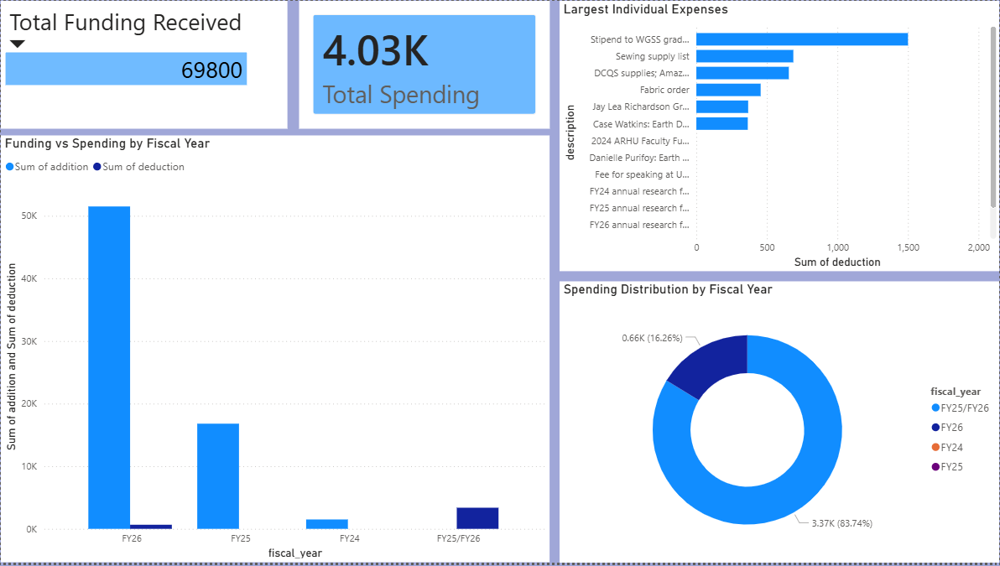

# Indigenous Futures Lab Budget Analysis

## Executive Summary

This project analyzes financial transaction data from the Indigenous Futures Lab and related research grant accounts using SQL and Power BI. The goal of the project was to clean, organize, and analyze funding and spending activity across multiple fiscal years in order to better understand grant utilization, spending patterns, and budget allocation trends.

The analysis was performed using MySQL and Visual Studio Code, with future dashboard visualizations planned in Power BI. This project demonstrates a real-world financial data workflow involving database setup, SQL-based data cleaning, exploratory analysis, and business-focused reporting.

## Business Problem

Research labs and grant-funded organizations often manage spending across multiple accounts, fiscal years, and funding sources. Without a centralized analysis workflow, it can be difficult to monitor spending behavior, remaining balances, and how funding is being allocated over time.

This project combines multiple financial tracking sheets into a structured SQL database to support easier financial analysis and future dashboard reporting.

## Data Overview

The dataset was created by combining multiple financial spreadsheets related to:
- Research grant funding
- Faculty research accounts
- Travel and supply expenses
- Award allocations and spending activity

The final cleaned dataset includes:
- Transaction dates
- Funding additions
- Expense deductions
- Fiscal years
- Descriptions of purchases and funding activity
- Net cash flow values

## Skills Used

- SQL querying and analysis
- MySQL database setup
- Data cleaning and validation
- Exploratory data analysis
- Financial data analysis
- Data storytelling for non-technical audiences
- Power BI dashboard planning
- GitHub project documentation

## Methodology

### Database Setup
- Imported raw CSV financial data into MySQL
- Created a structured SQL table using custom schema definitions
- Connected MySQL to Visual Studio Code using SQLTools

### Data Cleaning
SQL queries were used to:
- Check for null transaction dates
- Validate transaction types
- Identify duplicate records
- Review deduction values and financial consistency

### Exploratory Analysis
SQL analysis was performed to examine:
- Total funding received
- Total spending activity
- Net cash flow
- Largest expenses
- Spending trends by fiscal year

## Key SQL Analysis Questions

### Total Funding Received
This query calculated the total amount of incoming funding across all grant and research accounts.

### Total Spending
This analysis measured total expenses recorded in the dataset to evaluate overall spending behavior.

### Largest Expenses
The project identified the highest individual expenses to better understand where significant budget allocations were occurring.

### Fiscal Year Spending Trends
Grouping expenses by fiscal year helped identify how spending activity changed over time.

## Results

The SQL analysis revealed several important financial patterns across the Indigenous Futures Lab budget data. Funding activity and spending behavior varied significantly across fiscal years, with certain accounts receiving substantially larger allocations than others. The analysis also identified several high-cost transactions that represented major portions of overall spending activity.

The project additionally revealed how financial activity was distributed across research funding, travel expenses, supply purchases, and award-related spending. By centralizing the spreadsheets into a structured SQL database, the data became significantly easier to query, validate, and visualize for reporting purposes.

## Visualizations

### Power BI Dashboard: IFL Budget Overview

A single Power BI dashboard summarizes all financial activity, giving lab administrators and grant managers a quick, accurate view of budget health without digging through raw spreadsheets.

**KPI Cards:** Total Funding Received ($69,800) vs. Total Spending ($4.03K) — immediately shows the large gap between funds received and funds spent, which is critical for grant compliance.

**Funding vs Spending by Fiscal Year (Bar Chart):** Compares additions and deductions across FY24, FY25, FY26, and FY25/FY26. FY26 holds the largest funding (~$50K) with minimal spending; FY25/FY26 shows the most spending relative to funding received.

**Largest Individual Expenses (Bar Chart):** Ranks the top transactions by amount, led by a WGSS grad student stipend ($1,800), sewing supplies ($1,100), and DCQS/Amazon supplies ($1,050). Useful for spotting where budget is most concentrated.

**Spending Distribution by Fiscal Year (Donut Chart):** FY25/FY26 accounts for 83.74% ($3.37K) of total spending; FY26 accounts for 16.26% ($0.66K). Highlights that spending is concentrated in a narrow set of fiscal years.

## Recommendations

Based on the analysis, several opportunities for improving financial tracking and reporting were identified:
- Standardize transaction category naming across spreadsheets to improve reporting consistency
- Monitor large expense transactions more closely to better track budget concentration
- Continue centralizing financial records into a structured database system
- Expand dashboard reporting to support faster financial decision-making and budget reviews
- Consolidate recurring supply purchases (sewing supplies, fabric, DCQS/Amazon orders) into bulk or scheduled orders to reduce per-transaction costs and vendor fees

These recommendations could help improve long-term financial organization and increase visibility into grant and research spending activity.

## Tools Used

- MySQL
- SQL
- Visual Studio Code
- GitHub
- Power BI
- Excel / CSV Data Processing

## Next Steps

Future improvements to the project include:
- Adding category-based spending analysis
- Creating monthly spending trend visualizations
- Comparing funding received versus remaining balances over a longer period of time
- Expanding the project with additional statistical analysis techniques
- Developing more advanced financial trend reporting and anomaly detection